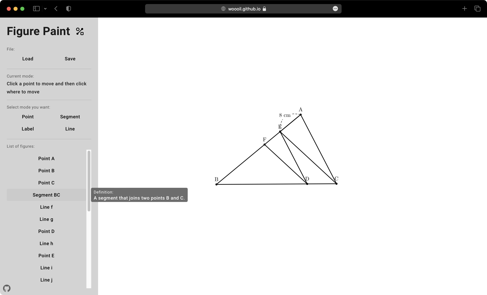

# [Figure Paint](https://woooil.github.io/figure-paint/)

A paint web application specialized for creating diagrams of geometric shapes.

You can [try it now!](https://woooil.github.io/figure-paint/)

## Supporting Features

- Drawing
  - Point
    - A point where you click
    - A point here another point is rotated by the given angle around a reference point
    - A point on a segment
    - A point of intersection of two lines
  - Line segment
    - A line segment that joins two points
  - Line
    - A line that passes thorugh two points
    - A line that is parallel to another line and passes through a point
  - Label
    - A label displaying the name of a point
    - A label displaying the name of a segment
- File
  - Save
    - Save as `.fpd` file which is the native format of Figure Paint.
    - Save as `.png` file
    - Save as `.svg` file
  - Load
    - Load `.fpd` file so that you can continue drawing from your previous work.

## Version

- v1.0.0 (2022.09.13)
  - The first relase

## License

Not yet determined
